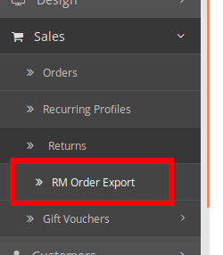

# Opencart order data export plug-in instructions

## Installation
1. Download the plug-in installation package
1. Upload the plugin installation package
Extensions> Extension Installer> upload Select the plug-in installation package file and confirm the upload

1. Enable plugin
Extensions> extensiion> Modules Find RM Order Exporter, click the magic wand button behind to enable the plugin

## Use
1. Open the plugin page
Extensions> extensiion> Modules Find RM Order Exporter, click the pencil button at the back to enter the plugin page

1. Enter directly from the administrator interface menu
Sales> RM Order Exporter, click directly to enter

1. Fill in the order id, you can use 3-5 to indicate orders with order id 3, 4, 5
Fill in the order ID to be exported in the Order IDs column, and be careful not to write an order ID that does not exist
1. Select the export file type
Support two export formats: Csv and Excel
1. Click the export button to download the export file
Click Export below to export and download the exported data file

## Trouble Shooting
1. When uploading the plugin, it prompts that the FTP server is not opened
This problem usually occurs in Opencart 2.x. The solution is to first decompress the QuickFix OC2.2.0.0.zip file in the document directory, and upload the localcopy.ocmod.xml obtained by decompression.

