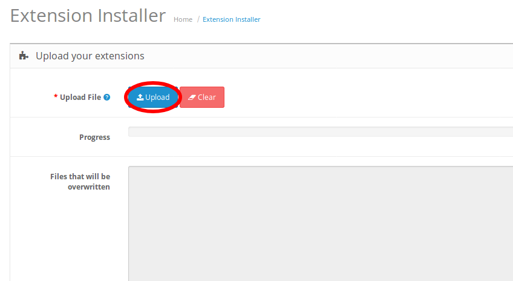
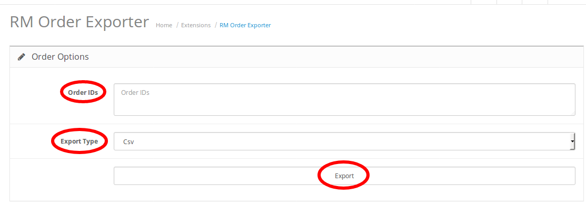

# Opencart订单数据导出插件使用说明

## 安装
1. 下载插件安装包
1. 上传插件安装包
Extensions > Extension Installer > upload选择插件安装包文件，确认上传

1. 启用插件
Extensions > extensiion > Modules找到RM Order Exporter，点击后面的魔法棒按钮，启用插件

## 使用
1. 打开插件页面
Extensions > extensiion > Modules找到RM Order Exporter，点击后面的铅笔按钮进入插件页面

1. 填写订单id，可以使用3-5表示订单id为3,4,5的订单
在Order IDs一栏中填写需要导出的订单ID，注意不要写不存在的订单ID
1. 选择导出文件类型
支持Csv和Excel两种导出格式
1. 点击导出按钮下载导出文件
点击下面的Export进行导出并下载导出的数据文件

## Trouble Shooting
1. 上传插件时提示FTP服务器没有打开
该问题一般发生在Opencart 2.x，解决方法是先解压document目录下的QuickFix OC2.2.0.0.zip文件，将解压得到的localcopy.ocmod.xml上传即可解决